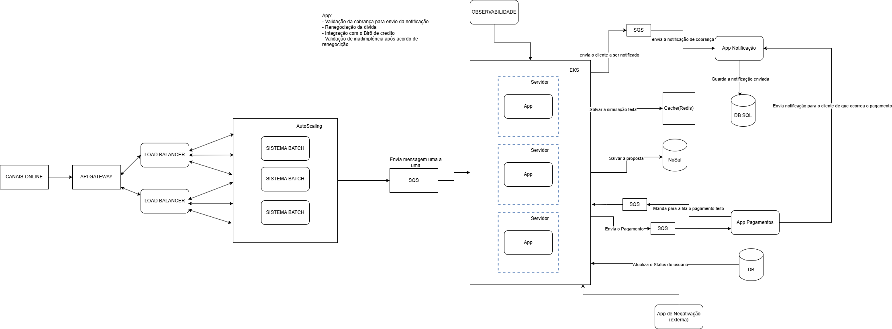

# Aplicação de Renegociação

## Descrição
Essa é uma aplicação que recebe um usuario que precisa ser notificado em caso de ter uma conta vencida

## O que é necessário para rodar
## AwsLocalStack
## Java 17
## MySQL
## MongoDb


## Instrução de Uso

1. Necessario rodar o Docker-Compose, para a instalação e iniciação do Mysql, MongoDb, LocalStack;
2. Será necessário criar uma fila SQS com o nome : fila-appBatch;
3. Será necessário criar uma fila SQS com o nome : fila-appNotification;
4. Será necessário criar uma fila SQS com o nome : fila-appPayment;
5. Será necessário criar uma fila SQS com o nome : fila-appProcessedPayment;

```md
Comando para criar: awslocal sqs create-queue --queue-name "substituir pelo nome da fila"};
```

### Comando para mandar mensagem para fila Batch, simulando a app Batch
```md
awslocal sqs send-message --queue-url http://sqs.sa-east-1.localhost.localstack.cloud:4566/000000000000/fila-appBatch --message-body '{\"id\":\"1\",\"name\":\"LUCAS\",\"document\":12345678910,\"email\":\"LUCAS@GMAIL.COM\",\"phones\":[\"11\",\"22\"],\"addresses\":[\"RUA\",\"BAIRRO\",\"AVENIDA\"],\"status\":\"Normal\",\"dueDate\":[2025,4,15],\"notification\":[2025,4,21],\"debt\": { \"id\":\"1\",\"debt\":\"Luz\",\"valueDebt\":550.0,\"debtMaturity\":[2025,4,15],\"user\":1},\"scoreCredit\":null,\"proposal\":null,\"payment\":{ \"id\":1, \"proposalId\": 1, \"cpf\":12345678910, \"amount\":440.0, \"method\": \"credit\", \"installments\": 8, \"card\": { \"tokenCard\": \"tokendocartaoaqui\", \"lastDigit\": \"6789\"},\"paid\": \"PAGO\"}, \"renegotiate\":true}'
```

## System Design

